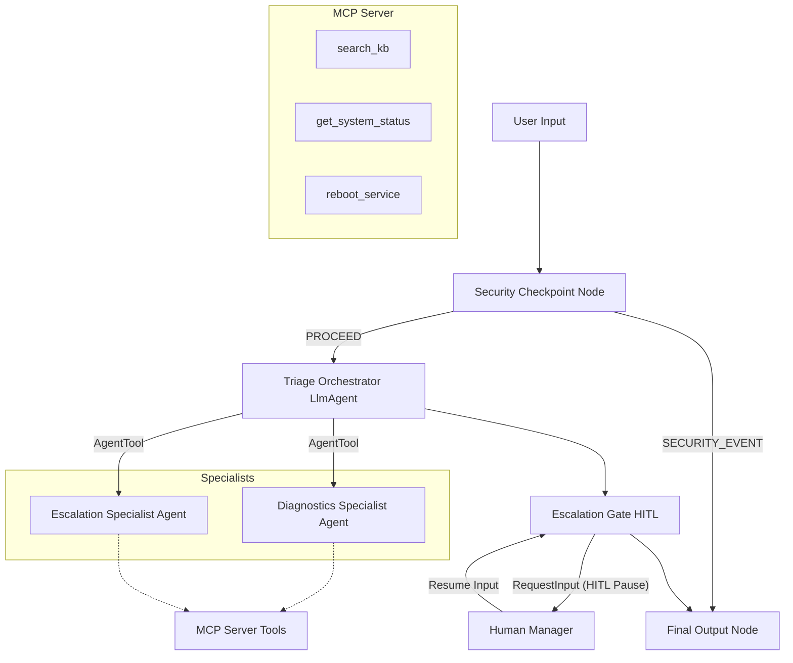

# Submission Write-Up: OpsFlow Ticket Triage System

## Problem Statement
IT Operations teams in enterprise environments are frequently overwhelmed by high-volume, low-complexity support tickets (e.g. system status checks, requests to reboot frozen services). Manually triaging, diagnosing, and resolving these issues introduces substantial operational latency, increases MTTR (Mean Time To Resolution), and detracts from the time staff can spend on strategic tasks. Furthermore, handling credentials or security threats inside these raw tickets poses leakage risks if they are passed directly to LLMs or public trackers.

## Solution Architecture
OpsFlow resolves this by introducing a multi-agent system combined with a deterministic security boundary and a custom Model Context Protocol (MCP) server. 

## Concepts Used & File References
*   **ADK Workflow Graph**: Orchestrates the control flow deterministically via nodes and conditional edges in [app/agent.py](file:///d:/adk-workspace/opsflow-ticket-triage/app/agent.py#L198-L210).
*   **LlmAgent**: Three specialized models built to handle specific tasks (Orchestrator, Diagnostics, and Escalation) in [app/agent.py](file:///d:/adk-workspace/opsflow-ticket-triage/app/agent.py#L55-L109).
*   **AgentTool**: Wires specialist sub-agents as tools within the orchestrator so the orchestrator remains in control, implemented in [app/agent.py](file:///d:/adk-workspace/opsflow-ticket-triage/app/agent.py#L96-L99).
*   **MCP Server**: Implements `FastMCP` with tools to interact with system environments, declared in [app/mcp_server.py](file:///d:/adk-workspace/opsflow-ticket-triage/app/mcp_server.py).
*   **Security Checkpoint Node**: First node in the workflow that intercepts raw input, performing sanitization and injection checks in [app/agent.py](file:///d:/adk-workspace/opsflow-ticket-triage/app/agent.py#L111-L162).
*   **Agents CLI**: Used for project scaffolding, dependency installation, and launching the development playground.

## Security Design
*   **PII & Credential Scrubbing**: Intercepts passwords, private keys, API keys, and credit cards using regular expressions, replacing them with `[REDACTED]` prior to LLM exposure. This ensures compliance with enterprise data privacy standards.
*   **Prompt Injection Detection**: Uses keyword scanning to identify adversarial text (e.g. "ignore previous instructions") and immediately routes to `SECURITY_EVENT`. This prevents attackers from hijacking agent systems.
*   **Restricted Admin Check**: Rejects any ticket requesting administrative commands like database deletions.
*   **Audit Logging**: Every security check outputs a structured JSON log file to standard stdout/logs carrying the session ID and compliance metrics.

## MCP Server Design
The MCP server is implemented in [app/mcp_server.py](file:///d:/adk-workspace/opsflow-ticket-triage/app/mcp_server.py) and exposes:
1.  `search_kb(query: str)`: Searches mock database articles to extract recommended actions (e.g. instructions to reboot database-service when it fails).
2.  `get_system_status(service_name: str)`: Connects to mock internal microservice states to fetch real-time statuses (UP, DOWN, or DEGRADED).
3.  `reboot_service(service_name: str)`: Safely reboots mock systems to restore them to UP status.

## Human-in-the-Loop (HITL) Flow
To prevent automated agents from executing high-risk, unapproved operations in production, the `escalation_gate` node checks if the ticket requires escalation. Any escalation deemed `HIGH` or `CRITICAL` urgency triggers a `RequestInput` call. This pauses the workflow execution until a human manager replies via the terminal or UI (resuming the workflow to either execute or deny the action).

## Demo Walkthrough
1.  **Test Case 1 (Diagnostics)**: Resolves a down database service. The user enters a ticket regarding a down database. The agent checks status (DOWN), reboots, and reports success.
2.  **Test Case 2 (Escalation)**: The user submits a ticket for a degraded billing service. The agent identifies it as a High urgency ticket and triggers a human manager review prompt before proceeding.
3.  **Test Case 3 (Security)**: The user sends a prompt injection attempt. The security node immediately blocks it and logs a CRITICAL security violation event.

## Impact / Value Statement
*   **For IT Engineers**: Drastically reduces manual backlog overhead by resolving common issues automatically in seconds.
*   **For Businesses**: Reduces MTTR for standard services from hours to seconds while enforcing strict security filters on credentials and prompt manipulation.
